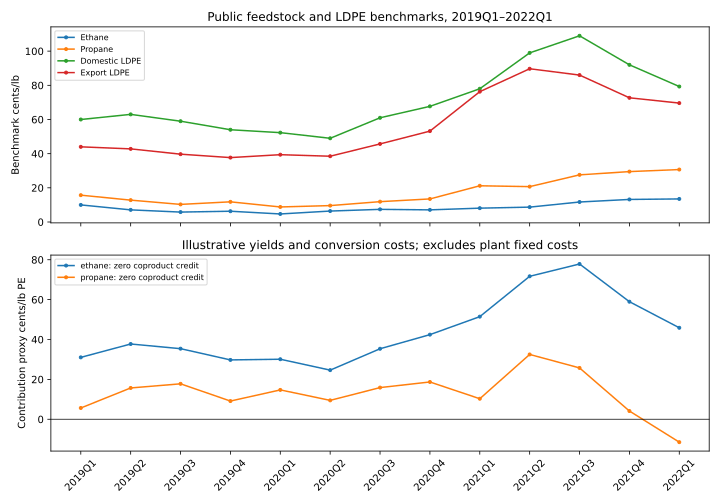

# What does a feedstock hedge protect in polyethylene production?

A feedstock hedge can stabilize the input bill while the polyethylene margin still falls. In this public historical sample, the ethane-route domestic LDPE contribution proxy averaged **33.5 cents/lb in 2019** and **61.2 cents/lb in 2021–2022Q1**, despite higher ethane prices. Product pricing matters as much as the feedstock story.

The 2021 spike reflects tight product supply alongside recovering demand: February's Winter Storm Uri shut plants, while polyethylene inventories were still depleted by the 2020 Gulf Coast hurricanes ([Westlake's Q2 2021 filing](https://www.sec.gov/Archives/edgar/data/1262823/000126282321000059/wlk-20210630.htm)). In the saved benchmarks, domestic LDPE rises from 67.7 cents/lb in 2020Q4 to 109.0 in 2021Q3, while ethane rises from 7.1 to 11.7; that much larger product-price increase drives the modeled margin expansion.



## What the model does

It follows ethane or propane through ethylene into polyethylene, with a mass balance at each step. It separates a merchant cracker contribution proxy from a polymerization proxy and reconciles both to an integrated contribution proxy. Domestic and export LDPE benchmarks give two product-price cases.

Prices are **cents per pound**, including feedstocks. The base assumptions are 80% ethylene mass yield for ethane, 42% for propane, 98% polymer yield, 10 cents/lb ethylene cracking cost and 6 cents/lb PE polymerization cost. Base coproduct credit is zero; the saved sensitivity varies yields and credits to show how the product slate changes the result.

For one pound of polyethylene:

- Feedstock required = `1 / (ethylene_yield × polymer_yield)` pounds.
- Integrated contribution = `PE price − [(feed price − coproduct credit) / ethylene_yield + cracking cost] / polymer_yield − polymerization cost`.
- Cracker contribution divided by polymer yield, plus polymerization contribution, gives the same answer.

## A consumer's hedge is long feedstock

The scenario model produces one million pounds of PE and buys the feedstock mass required by the selected yield. A long fixed-price swap pays `hedged feed pounds × (settlement index − fixed price) / 100` dollars. At 100% hedge coverage with no basis change, its gain exactly offsets an increase in feedstock expense. It does not protect the PE sale price or feedstock basis.

The scenarios use 2022Q1 benchmarks as a reference, with feedstock moves of ±20%, PE moves of ±15%, zero or 2 cents/lb feedstock basis widening, and 0%, 50% or 100% coverage. The reference feed price is the **assumed swap strike**.

For the ethane route, a 2 cents/lb basis widening costs about **$25,510** per million pounds of PE even with full benchmark hedging. A 15% decline from the reference domestic LDPE price costs **$118,950**, also outside that hedge.

## Data and reproduction

[Public quarterly inputs](data/public_quarterly_prices.csv) include the publication date and SEC source URL for every row. [Source notes](SOURCES.md) explain the benchmark definitions, vintages and discontinued disclosure. Westlake's public earnings materials attribute the benchmarks to IHS Markit.

```bash
cd projects/petchem-feedstock
pip install -r requirements.txt
pytest test_model.py
python run_analysis.py
```

Outputs include [historical margins](outputs/margin_history.csv), [regime summaries](outputs/regimes.csv), [hedge scenarios](outputs/hedge_scenarios.csv), [yield and coproduct sensitivity](outputs/yield_credit_sensitivity.csv), and [assumptions with the input hash](outputs/assumptions.json). Tests check the integrated mass balance, hedge direction and cancellation, residual PE and basis exposure, and coproduct credits.

## What I learned / what I would do differently

The useful result is the separation of risks: a feedstock hedge can work exactly as designed while overall contribution deteriorates. The mass balance also makes it clear why a cents-per-pound feed price cannot be subtracted directly from a cents-per-pound PE price. I would next replace assumed process costs and yields with independently sourced ranges, model the propane coproduct slate, and obtain a longer licensed price history before estimating hedge ratios or forecasting regimes.

## Limitations

This is a 13-quarter historical case study (2019Q1–2022Q1) using industry benchmarks and illustrative process assumptions. It estimates contribution proxies rather than company profit; the sample is too short for forecasting claims. Fixed costs, plant-specific energy consumption, freight, working capital, hedge fees and collateral are excluded. Zero coproduct credit particularly understates propane's product slate, so the base case cannot rank route profitability. Domestic/export terms differ, and actual hedge execution would require quoted strikes and grade/location basis. Scenarios are not a trading backtest. Inputs are public; no employer or client information is used.
